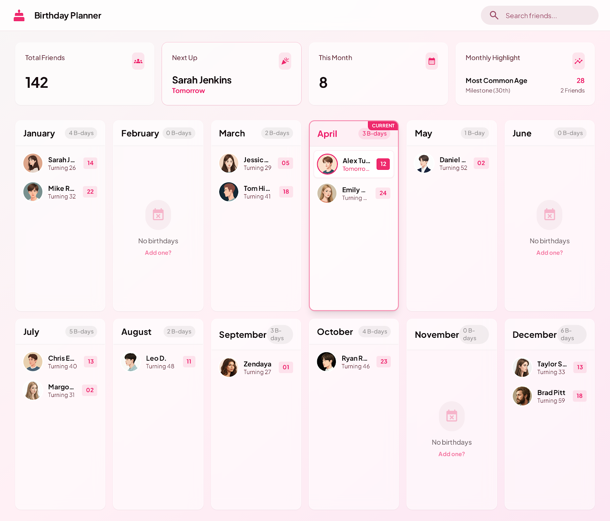

# Panas Birthdays 🎂

A modern web application to manage and track birthdays for your group of friends. Built with React, TypeScript, and Tailwind CSS.

## Preview



## Features

- 📅 **Calendar View**: Visual birthday calendar organized by month
- 📊 **Metrics Dashboard**: Quick overview of upcoming birthdays and statistics
- 👥 **Friend Management**: Track friends' birthdays with profile pictures and dates
- 🎨 **Modern UI**: Clean, responsive design with Tailwind CSS
- ⚡ **Fast Performance**: Built with Vite for optimal development and production builds

## Tech Stack

- **Frontend**: React 19 with TypeScript
- **Styling**: Tailwind CSS 4
- **Icons**: Lucide React
- **Build Tool**: Vite 7
- **Code Quality**: ESLint, Prettier

## Getting Started

### Prerequisites

- Node.js (v18 or higher recommended)
- bun

### Installation

1. Clone the repository:

```bash
git clone <repository-url>
cd panas-birthdays
```

2. Install dependencies:

```bash
bun install
```

3. Start the development server:

```bash
bun run dev
```

4. Open your browser and navigate to `http://localhost:5173`

## Available Scripts

- `bun run dev` - Start the development server
- `bun run build` - Build for production
- `bun run preview` - Preview the production build locally
- `bun run lint` - Run ESLint to check code quality

## Project Structure

```
panas-birthdays/
├── src/
│   ├── components/       # React components
│   │   ├── CalendarContainer.tsx
│   │   ├── EmptyMonthContainer.tsx
│   │   ├── FriendInfo.tsx
│   │   ├── Header.tsx
│   │   ├── MetricCard.tsx
│   │   ├── MetricCardContainer.tsx
│   │   └── MonthContainer.tsx
│   ├── data/            # Data files and mock data
│   │   ├── friends.json
│   │   └── mockFriends.ts
│   ├── utils/           # Utility functions
│   │   └── friendUtils.ts
│   ├── App.tsx          # Main application component
│   ├── main.tsx         # Application entry point
│   └── index.css        # Global styles
├── public/              # Static assets
├── docs/                # Documentation and design files
└── ...config files
```

## Usage

### Adding Friends

Edit the `src/data/friends.json` file to add or modify friend information:

```json
{
  "id": "1",
  "name": "Friend Name",
  "profilePicture": "url-to-profile-picture",
  "birthDate": "1990-01-15"
}
```

### Date Format

Birth dates should be in ISO format: `YYYY-MM-DD`

## Design System

The application follows a custom design system documented in the [docs/design](docs/design/) folder. The design includes:

- Color palette optimized for birthday tracking
- Typography scale for clear information hierarchy
- Component patterns for consistent UI

## Contributing

1. Fork the repository
2. Create a feature branch (`git checkout -b feature/amazing-feature`)
3. Commit your changes (`git commit -m 'Add some amazing feature'`)
4. Push to the branch (`git push origin feature/amazing-feature`)
5. Open a Pull Request

## License

This project is private and intended for personal use within the "panas" friend group.

---

Built with ❤️ for the panas
